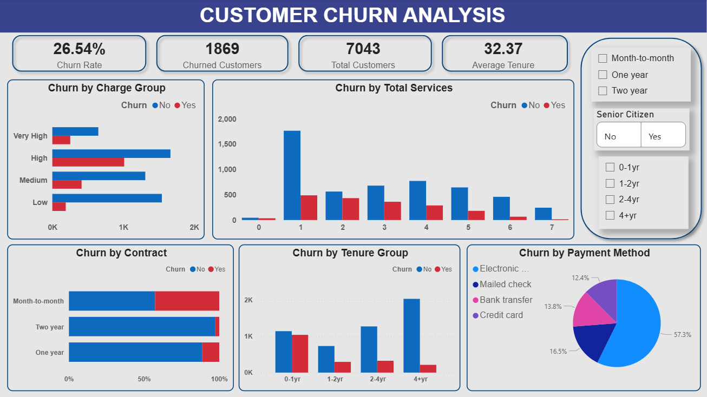

# Customer Churn Analysis (End-to-End Project)

## Project Overview
This project focuses on analyzing customer churn behavior using **Python, SQL, and Power BI**.  
The goal is to identify key factors contributing to churn and provide actionable business insights.

---

## Tech Stack
- **Python** (Pandas, Matplotlib, Seaborn) – Data Cleaning & EDA  
- **SQL (MySQL)** – Data Analysis & Querying  
- **Power BI** – Interactive Dashboard & Visualization  

---

## Project Workflow

### 1. Data Cleaning & EDA (Python)
- Handled missing values and data types  
- Created new features:
  - Tenure Groups
  - Charges Groups
  - Total Services  
- Performed exploratory data analysis:
  - Churn distribution  
  - Churn by contract, tenure, payment method  
  - Correlation analysis  

---

### 2️. Data Analysis (SQL)
- Calculated churn distribution & percentage  
- Analyzed churn by:
  - Contract type  
  - Payment method  
  - Tenure group  
  - Services used  
- Derived key metrics:
  - Average tenure  
  - Average monthly charges    

---

### 3️. Dashboard (Power BI)

## Key KPIs
- **Churn Rate:** 26.54%  
- **Churned Customers:** 1869  
- **Total Customers:** 7043  
- **Average Tenure:** 32.37  

---

## Dashboard Insights

- Customers with **month-to-month contracts** show the highest churn  
- **Electronic check** users have the highest churn rate  
- Customers with **low tenure (0–1 year)** are more likely to churn  
- **Churn decreases as tenure increases**  
- Lower service usage is associated with higher churn, suggesting reduced engagement leads to customer loss  
- Higher charges show slightly higher churn tendency, indicating possible price sensitivity

---

## Business Recommendations
- Focus on early customer retention by improving onboarding and engagement in the first year
- Promote long-term contracts through discounts and incentives to reduce churn risk
- Increase customer engagement through service bundling and reduce churn likelihood
- Optimize pricing strategies for high-paying customers to prevent churn due to cost concerns

---

## Dashboard Preview
1. 
2. [Churn Dashboard](./Churn_analysis.pbix)  -- Interactive dashboard
3. [EDA Notebook](./Customer_churn.ipynb)  
4. [SQL Queries](./Churn_queries.sql)  
5. [Kaggle Dataset Link](https://www.kaggle.com/code/basmalaawad/telco-customer-churn-dataset/input)
   
---

## Conclusion
- The analysis reveals that churn is primarily influenced by customer tenure, contract type, and service engagement. Strategic focus on retention, long-term contracts, and service engagement can significantly improve customer loyalty and reduce churn.
